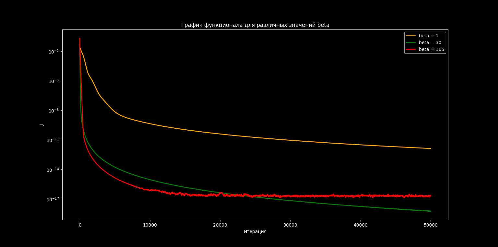

## RU Русский
### Коэффициентная обратная задача для нелинейного дифференциального уравнения в частных производных типа Бюргерса

<p align="center">
  
  
  
  
</p>

### Описание

Реализован **алгоритм градиентного спуска для решения коэффициентной обратной задачи** для нелинейного уравнения в частных производных типа Бюргерса. Цель — восстановить неизвестный пространственный коэффициент $q(x)$ по наблюдениям решения в конечный момент времени. Это классическая некорректно поставленная обратная задача, возникающая в физике и прикладной математике.


> **Курсовая работа** · 2-й курс · Физический факультет МГУ  
> Руководитель: доцент Лукьяненко Д.В.


---

### Постановка задачи

#### Прямая задача

Рассматривается нелинейное уравнение типа Бюргерса:

$$
\begin{cases}
\varepsilon\cdot \dfrac{\partial^2 u}{\partial x^2} - \dfrac{\partial u}{\partial t} = -u\cdot \dfrac{\partial u}{\partial x} + q(x)\cdot u, & x \in (0,1),\ t \in (0, T] \\
u(0,t) = u_{\text{left}}(t), \quad u(1,t) = u_{\text{right}}(t), & t \in (0, T] \\
u(x,0) = u_{\text{init}}(x), & x \in [0,1]
\end{cases}
$$

с граничными условиями $u(0,t) = u_\text{left}(t)$, $u(1,t) = u_\text{right}(t)$ и начальным условием $u(x,0) = u_\text{init}(x)$.

#### Обратная задача

Требуется восстановить неизвестный коэффициент $q(x)$ по дополнительному условию в финальный момент времени:

$$u(x, T) = f_\text{obs}(x), \quad x \in [0,1]$$

Задача является **некорректно поставленной**: оператор, сопоставляющий $q$ наблюдениям, является компактным и не имеет устойчивого обратного.

---

### Метод решения

#### Функционал Тихонова (Loss Function)

Обратная задача сводится к минимизации функционала с **L2-регуляризацией**. Регуляризующий член штрафует большие значения $q$ и стабилизирует решение при наличии шума в наблюдениях:

$$J[q] = \int_0^1 \bigl(u(x, T; q) - f_\text{obs}(x)\bigr)^2 dx + \alpha\cdot \int_0^1 q^2(x) dx$$


Итерационный процесс градиентного спуска:

$$
q^{(s+1)}(x) = q^{(s)}(x) - \beta_s \cdot \nabla J\bigl(q^{(s)}\bigr)(x)
$$

#### Нахождение градиента через сопряжённую задачу

Вводится функция $\psi(x,t)$ — решение сопряжённой задачи (решается в обратном времени):

$$
\begin{cases}
\varepsilon \cdot \dfrac{\partial^2 \psi}{\partial x^2} + \dfrac{\partial \psi}{\partial t} = u^{(s)}\cdot \dfrac{\partial \psi}{\partial x} + q^{(s)}(x)\cdot\psi, & x \in (0,1),\ t \in [0, T) \\
\psi^{(s)}(0,t) = 0, \quad \psi^{(s)}(1,t) = 0, & t \in [0, T) \\
\psi^{(s)}(x,0) = -2\cdot\bigl(u^{(s)}(x,T) - f_\text{obs}(x)\bigr), & x \in {[0,1]}
\end{cases}
$$

Градиент функционала выражается явной формулой:

$$
\nabla J\bigl(q^{(s)}\bigr)(x) = \int_0^T u^{(s)}(x,t)\cdot\psi^{(s)}(x,t) dt + 2\alpha\cdot q^{(s)}(x)
$$

На каждой итерации нужно решить **две задачи** (прямую и сопряжённую) — вне зависимости от размерности $q$, затем посчитать градиент по формуле выше и обновить $q^{(s)}$

#### Численная схема

Обе задачи решаются **методом прямых**: вводится равномерная сетка по $x$.
Вместо задачи поиска функции $u(x, t)$ ставится задачи поиска набора функций $u(x_n, t)$ для
каждого фиксированного $x_n$: 

$$
u_n \equiv u_n(t) \equiv u(x_n, t) = {?} \qquad x_n = a + h \cdot n, \qquad n = \overline{0, N}
$$

таким образом прямая и сопряженная задачи сводятся к системам ОДУ, которые интегрируются **одностадийной схемой Розенброка с комплексным коэффициентом**. Циклы, где это возможно, ускорены с помощью **Numba JIT**.

---

### Результаты

<p align="center">
  
  
</p>

#### Сходимость восстановления $q(x)$

Истинная функция $q(x) = \sin(3\pi x)$ (желтым), численное решение (зеленым):

- **$s = 1$** — нулевое начальное приближение
- **$s = 500$** — хорошее совпадение
- **$s = 1\,000$** — практически точное восстановление

#### Убывание функционала (Loss Function)



#### Влияние параметра шага $\beta_s$ (Learning Rate)

| $\beta_s$ | Поведение |
|-----------|-----------|
| Слишком большой (165) | Быстрый спуск, затем плато и осцилляции |
| Слишком маленький (1) | Медленная сходимость, нужно много итераций |
| Оптимальный (30) | Плавная и быстрая сходимость |

---

### Установка и запуск

```bash
git clone https://github.com/doctorshtopor/InverseProblem
cd InverseProblem

pip install numpy scipy matplotlib numba celluloid

python solver.py
```

---


## 🇬🇧 English
### Coefficient Inverse Problem for a Nonlinear Burgers-type PDE
 
<p align="center">
  
  
  
  
</p>
 
 
### Description
 
A **gradient descent algorithm for solving a coefficient inverse problem** for a nonlinear Burgers-type PDE is implemented. The goal is to recover an unknown spatial coefficient $q(x)$ from observations of the solution at the final time moment. This is a classical ill-posed inverse problem arising in physics and applied mathematics.
 
> **Course project** · 2nd year · Faculty of Physics, Moscow State University  
> Supervisor: Assoc. Prof. D.V. Lukyanenko
 
---
 
### Problem Statement
 
#### Forward Problem
 
We consider a nonlinear Burgers-type PDE:
 
$$
\begin{cases}
\varepsilon\cdot \dfrac{\partial^2 u}{\partial x^2} - \dfrac{\partial u}{\partial t} = -u\cdot \dfrac{\partial u}{\partial x} + q(x)\cdot u, & x \in (0,1),\ t \in (0, T] \\
u(0,t) = u_{\text{left}}(t), \quad u(1,t) = u_{\text{right}}(t), & t \in (0, T] \\
u(x,0) = u_{\text{init}}(x), & x \in [0,1]
\end{cases}
$$
 
with boundary conditions $u(0,t) = u_\text{left}(t)$, $u(1,t) = u_\text{right}(t)$ and initial condition $u(x,0) = u_\text{init}(x)$.
 
#### Inverse Problem
 
The unknown coefficient $q(x)$ must be recovered from the additional condition at the final time moment:
 
$$u(x, T) = f_\text{obs}(x), \quad x \in [0,1]$$
 
The problem is **ill-posed**: the operator mapping $q$ to observations is compact and has no stable inverse.
 
---
 
### Method
 
#### Tikhonov Functional (Loss Function)
 
The inverse problem is reformulated as minimization of a functional with **L2 regularization**. The regularization term penalizes large values of $q$ and stabilizes the solution against noise in the observations:
 
$$J[q] = \int_0^1 \bigl(u(x, T; q) - f_\text{obs}(x)\bigr)^2 dx + \alpha\cdot \int_0^1 q^2(x)\, dx$$
 
Gradient descent iterative update:
 
$$
q^{(s+1)}(x) = q^{(s)}(x) - \beta_s \cdot \nabla J\bigl(q^{(s)}\bigr)(x)
$$
 
#### Gradient via Adjoint Problem
 
An adjoint variable $\psi(x,t)$ is introduced — the solution of the adjoint problem (solved backward in time):
 
$$
\begin{cases}
\varepsilon \cdot \dfrac{\partial^2 \psi}{\partial x^2} + \dfrac{\partial \psi}{\partial t} = u^{(s)}\cdot \dfrac{\partial \psi}{\partial x} + q^{(s)}(x)\cdot\psi, & x \in (0,1),\ t \in [0, T) \\
\psi^{(s)}(0,t) = 0, \quad \psi^{(s)}(1,t) = 0, & t \in [0, T) \\
\psi^{(s)}(x,0) = -2\cdot\bigl(u^{(s)}(x,T) - f_\text{obs}(x)\bigr), & x \in {[0,1]}
\end{cases}
$$
 
The gradient of the functional is given by the explicit formula:
 
$$
\nabla J\bigl(q^{(s)}\bigr)(x) = \int_0^T u^{(s)}(x,t)\cdot\psi^{(s)}(x,t)\, dt + 2\alpha\cdot q^{(s)}(x)
$$
 
At each iteration, **two problems** must be solved (forward and adjoint) — regardless of the dimensionality of $q$ — then the gradient is computed by the formula above and $q^{(s)}$ is updated.
 
#### Numerical Scheme
 
Both problems are solved via the **method of lines**: a uniform grid in $x$ is introduced. Instead of finding $u(x,t)$, we seek a set of functions $u(x_n, t)$ for each fixed $x_n$:
 
$$
u_n \equiv u_n(t) \equiv u(x_n, t) = {?} \qquad x_n = a + h \cdot n, \qquad n = \overline{0, N}
$$
 
The forward and adjoint problems thus reduce to ODE systems, which are integrated with a **one-stage Rosenbrock scheme with complex coefficient**. Loops where possible are accelerated with **Numba JIT**.
 
---
 
### Results
 
<p align="center">
  
  
</p>
 
#### Convergence of $q(x)$ Recovery
 
True function $q(x) = \sin(3\pi x)$ (yellow), numerical solution (green):
 
- **$s = 1$** — zero initial guess
- **$s = 500$** — good match
- **$s = 1\,000$** — near-perfect recovery
 
#### Functional Decay (Loss Function)

 
#### Step Size Sensitivity (Learning Rate $\beta_s$)
 
| $\beta_s$ | Behavior |
|-----------|----------|
| Too large (165) | Fast initial drop, then plateau oscillations |
| Too small (1) | Slow convergence, requires many more iterations |
| Optimal (30) | Smooth, fast convergence |
 
---
 
### Installation & Usage
 
```bash
git clone https://github.com/doctorshtopor/InverseProblem
cd InverseProblem
 
pip install numpy scipy matplotlib numba celluloid
 
python solver.py
```
 
---
 
<p align="center">
  <sub>Московский государственный университет · Физический факультет · Кафедра математики · 2025</sub>
</p>
