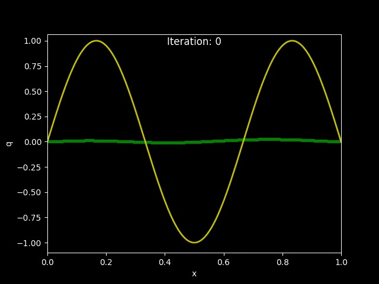
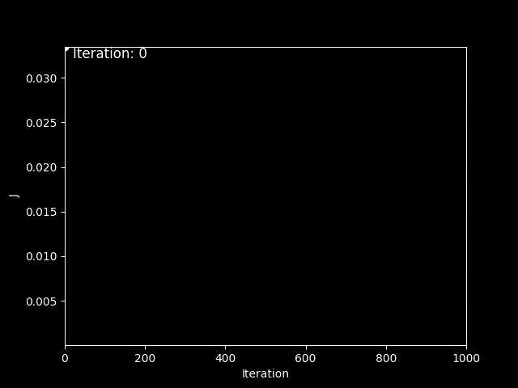

## 🇷🇺 Русский
### Градиентный спуск для коэффициентной обратной задачи (уравнение типа Бюргерса)

<p align="center">
  
  
  
  
</p>

### Описание

Реализован **алгоритм градиентного спуска для решения коэффициентной обратной задачи** для нелинейного уравнения в частных производных типа Бюргерса. Цель — восстановить неизвестный пространственный коэффициент $q(x)$ по наблюдениям решения в конечный момент времени. Это классическая некорректно поставленная обратная задача, возникающая в физике и прикладной математике.

Градиент функционала вычисляется аналитически через **сопряжённую задачу** — стандартный подход в задачах оптимального управления.

> **Курсовая работа** · 2-й курс · Физический факультет МГУ  
> Руководитель: доцент Лукьяненко Д.В.


---

### Постановка задачи

#### Прямая задача

Рассматривается нелинейное уравнение типа Бюргерса:

$$
\begin{cases}
\varepsilon\cdot \dfrac{\partial^2 u}{\partial x^2} - \dfrac{\partial u}{\partial t} = -u\cdot \dfrac{\partial u}{\partial x} + q(x)\cdot u, & x \in (0,1),\ t \in (0, T] \\
u(0,t) = u_{\text{left}}(t), \quad u(1,t) = u_{\text{right}}(t), & t \in (0, T] \\
u(x,0) = u_{\text{init}}(x), & x \in [0,1]
\end{cases}
$$

с граничными условиями $u(0,t) = u_\text{left}(t)$, $u(1,t) = u_\text{right}(t)$ и начальным условием $u(x,0) = u_\text{init}(x)$.

#### Обратная задача

Требуется восстановить неизвестный коэффициент $q(x)$ по дополнительному условию в финальный момент времени:

$$u(x, T) = f_\text{obs}(x), \quad x \in [0,1]$$

Задача является **некорректно поставленной**: оператор, сопоставляющий $q$ наблюдениям, является компактным и не имеет устойчивого обратного.

---

### Метод решения

#### Функционал Тихонова

Обратная задача сводится к минимизации регуляризованного функционала:

$$J[q] = \int_0^1 \bigl(u(x, T; q) - f_\text{obs}(x)\bigr)^2 dx + \alpha\cdot \int_0^1 q^2(x) dx$$

Итерационный процесс градиентного спуска:

$$
q^{(s+1)}(x) = q^{(s)}(x) - \beta_s \cdot \nabla J\bigl(q^{(s)}\bigr)(x)
$$

#### Нахождение градиента через сопряжённую задачу

Вводится функция $\psi(x,t)$ — решение сопряжённой задачи (решается в обратном времени):

$$
\begin{cases}
\varepsilon \cdot \dfrac{\partial^2 \psi}{\partial x^2} + \dfrac{\partial \psi}{\partial t} = u^{(s)}\cdot \dfrac{\partial \psi}{\partial x} + q^{(s)}(x)\cdot\psi, & x \in (0,1),\ t \in [0, T) \\
\psi^{(s)}(0,t) = 0, \quad \psi^{(s)}(1,t) = 0, & t \in [0, T) \\
\psi^{(s)}(x,0) = -2\cdot\bigl(u^{(s)}(x,T) - f_\text{obs}(x)\bigr), & x \in {[0,1]}
\end{cases}
$$

Градиент функционала выражается явной формулой:

$$
\nabla J\bigl(q^{(s)}\bigr)(x) = \int_0^T u^{(s)}(x,t)\cdot\psi^{(s)}(x,t) dt + 2\alpha\cdot q^{(s)}(x)
$$

На каждой итерации нужно решить лишь **две задачи** (прямую и сопряжённую) — вне зависимости от размерности $q$.

#### Численная схема

Обе задачи решаются **методом прямых**: равномерная сетка по $x$, затем система ОДУ по времени, интегрируемая **одностадийной схемой Розенброка с комплексным коэффициентом**. Горячие циклы ускорены с помощью **Numba JIT**.

---

### Результаты

<p align="center">
  
  
</p>

#### Сходимость восстановления $q(x)$

Истинная функция $q(x) = \sin(3\pi x)$ (желтым), численное решение (зеленым):

- **$s = 1$** — нулевое начальное приближение
- **$s = 500$** — хорошее совпадение
- **$s = 1\,000$** — практически точное восстановление

#### Убывание функционала

$J[q^{(s)}]$ монотонно убывает за ~8000 итераций, достигая значений порядка $10^{-15}$.

#### Влияние параметра шага $\beta_s$

| $\beta_s$ | Поведение |
|-----------|-----------|
| Слишком большой (165) | Быстрый спуск, затем плато и осцилляции |
| Слишком маленький (1) | Медленная сходимость, нужно много итераций |
| Оптимальный (30) | Плавная и быстрая сходимость |

---

### Установка и запуск

```bash
git clone https://github.com/doctorshtopor/<repo-name>
cd <repo-name>

pip install numpy scipy matplotlib numba celluloid

python solver.py
```

---


## 🇬🇧 English
 
### Overview
 
This project implements a **gradient descent algorithm for solving a coefficient inverse problem** governed by a nonlinear Burgers-type PDE. The goal is to recover an unknown spatial coefficient $q(x)$ from indirect observations of the solution at the final time moment — a classical ill-posed inverse problem arising in physics and engineering.
 
The gradient of the cost functional is computed via an **adjoint (conjugate) problem**, which is the standard approach in PDE-constrained optimization and optimal control. Both the forward and adjoint problems are solved numerically using the **method of lines** combined with a **Rosenbrock scheme with complex coefficient**.
 
> **Course project** · 2nd year · Faculty of Physics, Moscow State University  
> Supervisor: Assoc. Prof. D.V. Lukyanenko
 
---
 
### Problem Statement
 
#### Forward Problem
 
We consider a nonlinear Burgers-type PDE:
 
$$
\begin{cases}
\varepsilon\cdot \dfrac{\partial^2 u}{\partial x^2} - \dfrac{\partial u}{\partial t} = -u\cdot \dfrac{\partial u}{\partial x} + q(x)\cdot u, & x \in (0,1),\ t \in (0, T] \\
u(0,t) = u_{\text{left}}(t), \quad u(1,t) = u_{\text{right}}(t), & t \in (0, T] \\
u(x,0) = u_{\text{init}}(x), & x \in [0,1]
\end{cases}
$$
 
#### Inverse Problem
 
The unknown coefficient $q(x)$ must be recovered from the observation at the final time:
 
$$u(x, T) = f_\text{obs}(x), \quad x \in [0,1]$$
 
This is an **ill-posed problem**: the map from $q$ to observations is compact and has no stable inverse.
 
---
 
### Method
 
#### Tikhonov Functional
 
We reformulate the inverse problem as minimization of a regularized functional:
 
$$J[q] = \int_0^1 \bigl(u(x, T; q) - f_\text{obs}(x)\bigr)^2 dx + \alpha\cdot \int_0^1 q^2(x) dx$$
 
The iterative update is:
 
$$
q^{(s+1)}(x) = q^{(s)}(x) - \beta_s \cdot \nabla J\bigl(q^{(s)}\bigr)(x)
$$
 
#### Gradient via Adjoint Problem
 
The gradient is derived analytically using the **adjoint state method**: by introducing an adjoint variable $\psi(x,t)$ satisfying a backward-in-time PDE:
 
$$
\begin{cases}
\varepsilon \cdot \dfrac{\partial^2 \psi}{\partial x^2} + \dfrac{\partial \psi}{\partial t} = u^{(s)}\cdot \dfrac{\partial \psi}{\partial x} + q^{(s)}(x)\cdot\psi, & x \in (0,1),\ t \in [0, T) \\
\psi^{(s)}(0,t) = 0, \quad \psi^{(s)}(1,t) = 0, & t \in [0, T) \\
\psi^{(s)}(x,0) = -2\cdot\bigl(u^{(s)}(x,T) - f_\text{obs}(x)\bigr), & x \in {[0,1]}
\end{cases}
$$
 
the gradient takes the closed-form expression:
 
$$
\nabla J\bigl(q^{(s)}\bigr)(x) = \int_0^T u^{(s)}(x,t)\cdot\psi^{(s)}(x,t) dt + 2\alpha\cdot q^{(s)}(x)
$$
 
This approach requires solving **only two PDEs per iteration** (forward + adjoint), regardless of the dimensionality of $q$.
 
#### Numerical Scheme
 
Both PDEs are discretized via the **method of lines**: uniform spatial grid, then a system of ODEs in time:
 
$$
\frac{d\vec{y}}{dt} = \vec{f}(\vec{y}, t), \quad \vec{y}(0) = \vec{y}_0
$$
 
The ODE system is integrated with a **one-stage Rosenbrock scheme with complex coefficient**:
 
 
---
 
### Results
 
#### Convergence of $q(x)$ Recovery
 
The true coefficient is $q(x) = \sin(3\pi x)$ (green). The recovered solution (orange) converges progressively:
 
| Iteration | Result |
|-----------|--------|
| $s = 1$ | Initial guess (flat zero) |
| $s = 100$ | Rough shape |
| $s = 1000$ | Good match |
| $s = 10\,000$ | Near-perfect recovery |
 
> 📷 *Convergence plots from the paper — add images to `results/` and uncomment below*  
> <!--   -->
 
#### Functional Decay
 
The cost functional $J[q^{(s)}]$ decreases monotonically over ~8000 iterations, reaching values around $10^{-15}$ — confirming convergence to the minimum.
 
> 📷 *See `results/functional_decay.png`*
 
#### Step Size Sensitivity
 
The choice of descent step $\beta_s$ critically affects convergence:
 
| $\beta_s$ | Behavior |
|-----------|----------|
| Too large (e.g. 165) | Fast initial drop, then plateau oscillations |
| Too small (e.g. 1) | Slow monotone decrease, requires far more iterations |
| Optimal (e.g. 30) | Smooth, fast convergence |
 
---
 
### Installation & Usage
 
```bash
git clone https://github.com/doctorshtopor/<repo-name>
cd <repo-name>
 
pip install numpy scipy matplotlib numba celluloid
 
python solver.py
```
 
---
 
### Project Structure
 
```
.
├── solver.py            # Main: forward problem, adjoint problem, gradient descent
├── schemes.py           # Rosenbrock scheme, method of lines
├── results/             # Output figures and animations
└── README.md
```
 
---
 
### Stack
 
| Tool | Purpose |
|------|---------|
| `numpy` | Array operations, spatial discretization |
| `scipy.integrate` | ODE integration fallback |
| `numba` | JIT acceleration of inner loops |
| `matplotlib` | Plotting convergence and functional |
| `celluloid` | Animated convergence GIF |
 
---


---

<p align="center">
  <sub>Московский государственный университет · Физический факультет · Кафедра математики · 2025</sub>
</p>
